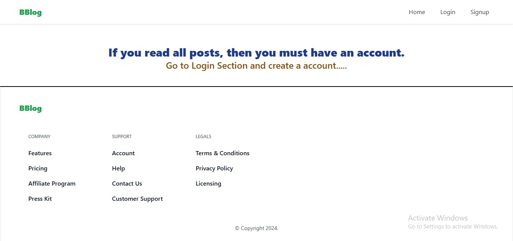
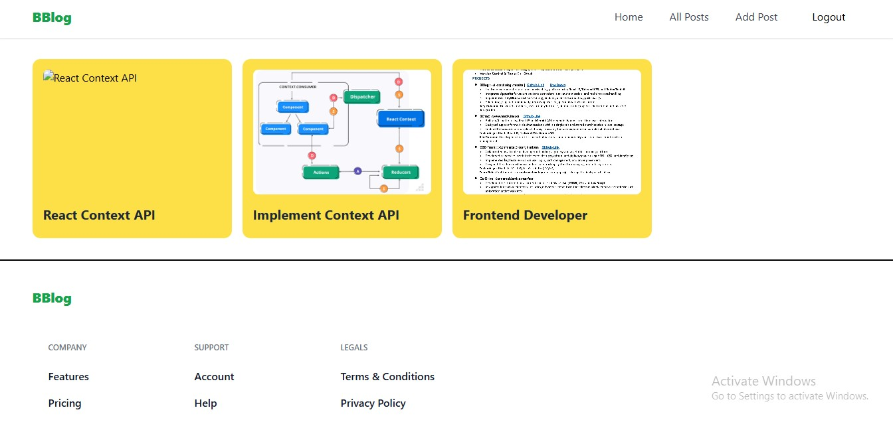
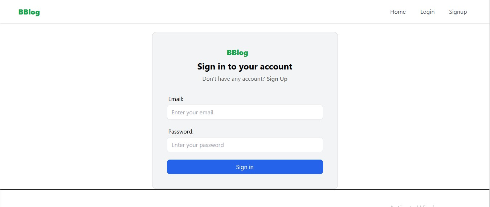
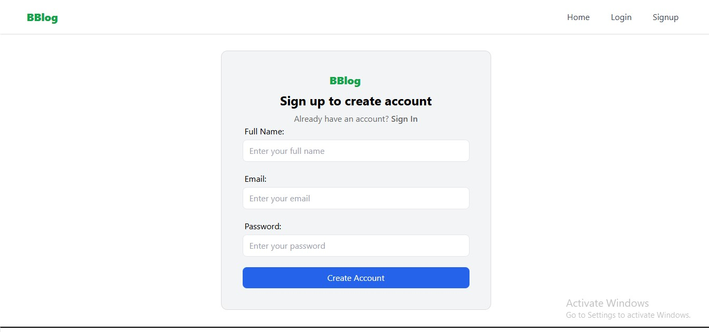
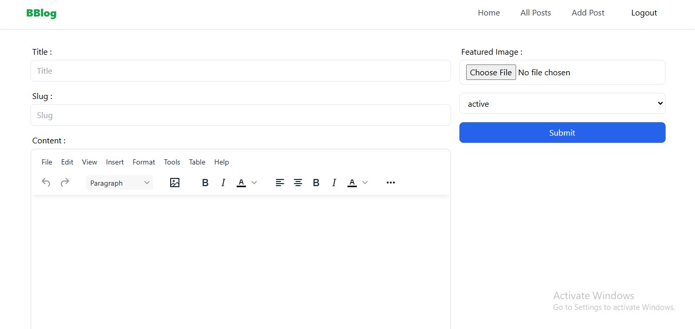
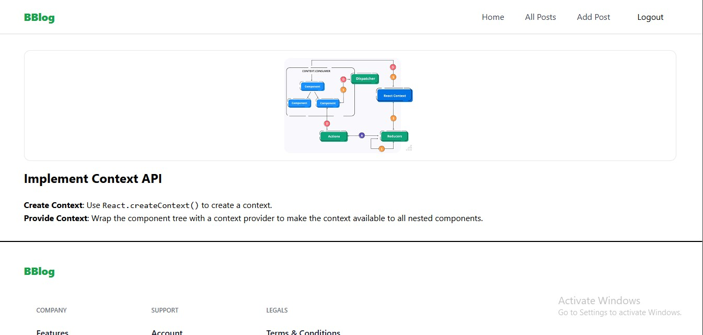

# BBlog
<h1>BBlog: This is a blog website</h1>


- [Live-link](https://b-blog-seven.vercel.app/)


# BBlog - A Modern Blogging Platform

BBlog is a responsive and feature-rich blogging platform built using modern web technologies. It offers a clean and minimalistic interface for users to explore and read engaging blog posts.

## Images








## Features

- **Responsive Design**: Fully optimized for mobile, tablet, and desktop devices.
- **Modern UI**: Built using React JS and Tailwind CSS for a sleek user experience.
- **State Management**: Redux for managing application state efficiently.
- **Authentication**: Secure user login and session management.
- **Backend as a Service**: Appwrite integration for managing database, authentication, and more.
- **Dynamic Content**: Users can explore blog posts dynamically fetched from the backend.

## Technologies Used

- **Frontend**:
  - React JS
  - Tailwind CSS
  - Redux
- **Backend**:
  - Appwrite (Backend-as-a-Service)
- **Others**:
  - JavaScript (ES6+)
  - Git for version control

## Installation and Setup

To run the project locally, follow these steps:


### Steps

1. **Clone the Repository**:
   ```bash
   git clone https://github.com/yourusername/BBlog.git
   cd BBlog
   ```
2. **Install Dependencies:**
 ```bash
   npm install
   ```
3. **Set Up Environment Variables:**
Create a .env file in the root directory.
```bash
VITE_APPWRITE_URL
VITE_APPWRITE_PROJECT_ID
VITE_APPWRITE_DATABASE_ID
VITE_APPWRITE_COLLECTION_ID
VITE_APPWRITE_BUCKET_ID
VITE_RTE_ID
```

